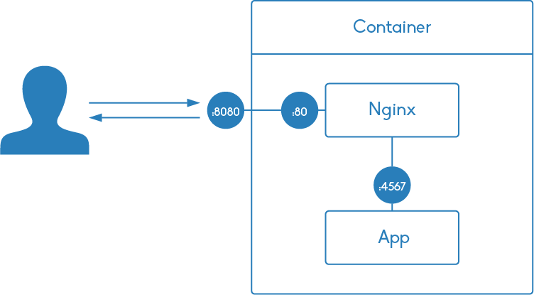

# Nginx Caching Example

Exercise used in my [blog post](http://czerasz.com/2015/03/30/nginx-caching-tutorial/).

## Overview

The diagram below illustrates the docker environment used in this exercise:

## Setup

Build the image:
    
    ./bin/build-container.sh

Start the container:

    ./bin/start-container.sh 

## Removing Objects from Cache

Removing objects from the cache is called purging. In this example Nginx was build together with the [Cache Purge Module](https://github.com/FRiCKLE/ngx_cache_purge) which enables the purging functionality.

The instructions below will guide you through the process.

Save an object in the cache:

    curl localhost:8080/test

Ensure that the request was cached:

    $ docker diff nginx-cache-example | grep 'A /tmp/nginx/cache/a/da/'
    A /tmp/nginx/cache/a/da/c3d3bae866df806718afd1153a9ffdaa

Purge from outside:

    $ curl -XPURGE localhost:8080/test
    <html>
    <head><title>Successful purge</title></head>
    <body bgcolor="white">
    
<h1>Successful purge</h1>
     Key : httplocalhost/test
     Path: /tmp/nginx/cache/a/da/c3d3bae866df806718afd1153a9ffdaa
    

    

nginx/1.6.2

    </body>
    </html>

You can also purge from inside the container with this command:

    docker exec nginx-cache-example curl -i localhost/purge/test

## Requirements

- [Docker](https://www.docker.com/)
- [curl](http://curl.haxx.se/)

## Resources

- [Nginx Cache Purge Module](https://github.com/FRiCKLE/ngx_cache_purge)
